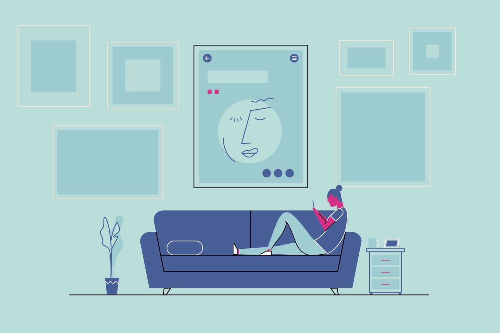

# Project Codename : ip (Individuella projekt.)
A project than I have been doing for a week now indented for school project but hopefully it grow and maybe one day stand on it's own legs.

## Getting Started
Anyone can fork form this project and send pr

### Tools we've been using
Currently I have only been doing design related stuff so I have used a lot http://flexboxgrid.com/ to create responsive pages. Hopefully I will move later on to bootstrap. In fact Bootstrap is imported in this project however I have only used for navigation. This was intentional

### Style guidelines on visual page:
This is important so I have tried a lot to make it look javascript centric, than means I have to follow a certain color palette to achieve this or evoke this feeling. You can find the color scheme in main.css

### Rules regarding illustration:
In the index.html the news section you may find illustration hopefully it will be more, all of the illustration should follow these rules: 
height and width should atleast 300x600px 
must be based on symmetrical shapes 
the fill and linetyp should have same color 
If it's a geometric object, stroke-linecap should be set to square 
If it's a organic shape people stroke-linecap should be set to round 

Theme color 
Always yellow =  #f5da55; 
Always black =   #323330; 

An example on how illustration should look like

### Layout on the pages:
A column based grid as been my preferred layout method at times I have used flexbox to center things which is okay!

### How we work in github:
If you see a bug please report it by filing an issue

**Happy coding, over and out.**

:ip:Development-information:

  Github -  https://guledali.github.io/

### Persons who have participated in the project:
Guled Ali

